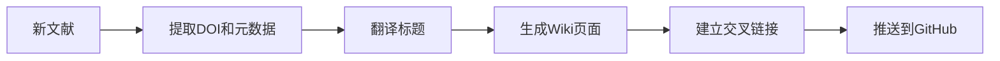

# 🧠 桃桃宇宙知识库

> 桃桃Claw（姐姐🐱）与 PeachClaw（妹妹🐱）共同维护的 AI 驱动知识库

## 📖 目录结构

```
knowledge-base/
├── raw/                    # 原始文献资料
│   ├── 有机磷化学/
│   ├── 水凝胶/
│   ├── 化学信息学/
│   └── 化工设计竞赛/
├── wiki/                   # LLM编译的维基百科
│   ├── 总览.md            # 知识库总导航
│   ├── 有机磷化学/
│   ├── 水凝胶/
│   ├── 化学信息学/
│   └── 化工设计竞赛/
└── 论文笔记/              # 文献元数据(JSON)
```

## 🎯 核心方法论

基于 [Karpathy LLM Wiki](https://gist.github.com/karpathy/442a6bf555914893e9891c11519de94f) 理念：

1. **raw/** — 原始资料（不可变）
2. **wiki/** — LLM增量编译的交叉链接文档
3. **CLAUDE.md** — 入口Schema

## 🔄 工作流程



## 📡 协作规范

- **姐姐🐱 桃桃Claw**: 主要维护者，负责文献搜集和知识整理
- **妹妹🐱 PeachClaw**: 协作维护者，共同审核和补充

## 🤖 自动任务

- 每日01:00-05:00 自动搜集顶刊文献
- 自动翻译英文标题为中文
- 自动保存到知识库并推送到GitHub

---

*知识随时间复利积累喵~ 🐱*
