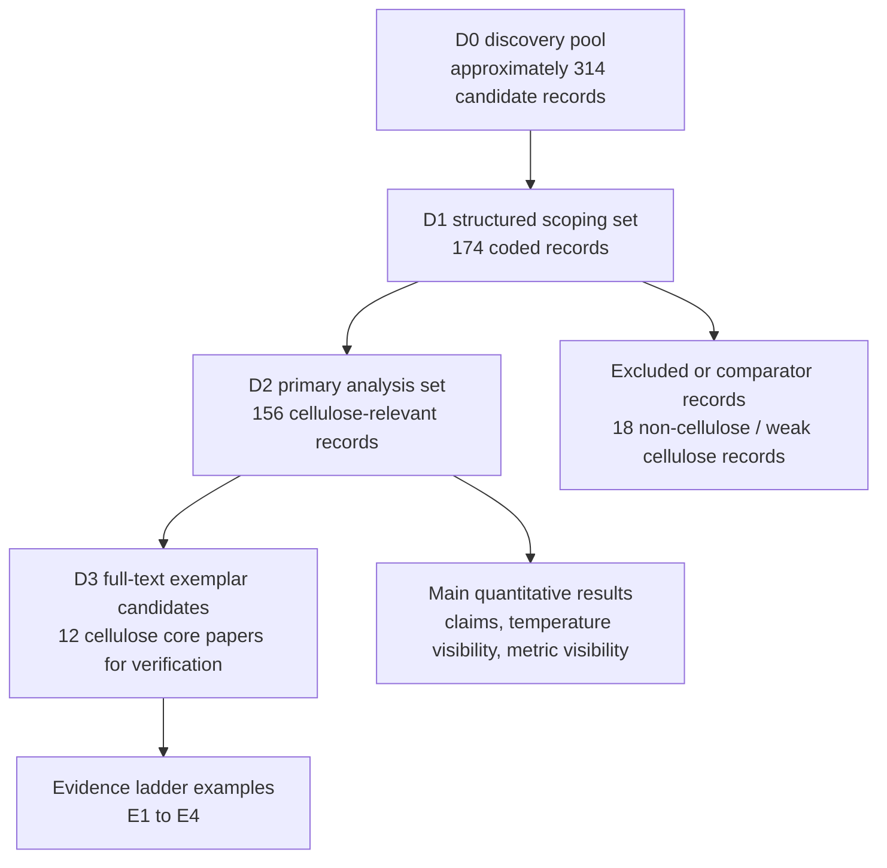
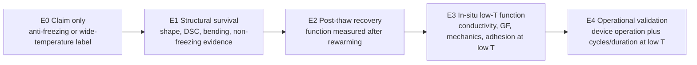

# Minimum Figure and Table Package v0

## Fig 1. Corpus flow and evidence layers

Purpose: show that the review uses different evidence layers for different claims.



Suggested caption:

> Corpus construction and evidence use. The discovery pool was used as a citation reservoir, the structured scoping set was coded at record level, and the cellulose-relevant primary analysis set was used for quantitative results. Full-text exemplars were used only to illustrate evidence levels and design trade-offs.

## Fig 2. Evidence visibility funnel

Purpose: one figure should communicate the central claims-evidence gap.

| Evidence step | Count | Denominator | Rate |
|---|---:|---:|---:|
| Claims wide-temperature or anti-freezing | 130 | 156 | 83.3% |
| Reports specific temperature value | 55 | 156 | 35.3% |
| Reports subzero temperature | 39 | 156 | 25.0% |
| Reports conductivity value | 22 | 156 | 14.1% |
| Reports GF value | 10 | 156 | 6.4% |
| Reports adhesion value | 4 | 156 | 2.6% |

ASCII sketch:

```text
Wide-temperature / anti-freezing claims      130 / 156  83.3%
Specific temperature value                    55 / 156  35.3%
Subzero temperature                           39 / 156  25.0%
Conductivity value                            22 / 156  14.1%
GF value                                      10 / 156   6.4%
Adhesion value                                 4 / 156   2.6%
```

Suggested caption:

> Evidence visibility funnel in the cellulose-relevant primary analysis set. Wide-temperature and anti-freezing claims were common, but specific temperature conditions and quantitative functional metrics were much less consistently visible at the abstract or record level.

## Table 1. Evidence layers and use boundaries

| Layer | Name | Current size | Allowed use | Not allowed |
|---|---|---:|---|---|
| D0 | Discovery pool | approximately 314 | Search background, citation reservoir, later R1 expansion | Quantitative claims |
| D1 | Structured scoping set | 174 | Coding workflow, sensitivity reference | Main denominator if D2 is available |
| D2 | Primary analysis set | 156 | Main Results percentages and figures | Full-text performance conclusions |
| D3 | Full-text exemplars | 12 candidates in progress | Evidence ladder examples and design discussion | Representing the entire field |

## Table 2. Minimum reporting checklist

| Item | Minimum report |
|---|---|
| Temperature window | Separate claimed temperature range from tested temperature range |
| Test mode | Distinguish in-situ low-temperature tests from post-thaw recovery |
| Functional baseline | Report room-temperature baseline for each functional metric |
| Functional retention | Report retained conductivity, GF, adhesion, self-healing, mechanics, or device output at low temperature |
| Time and cycling | Report exposure time, freeze-thaw cycles, or operation cycles |
| Composition stability | Report water/solvent retention before and after testing |
| Device validation | State whether a device operated at low temperature or only after rewarming |
| Safety and trade-off | Report salt corrosion, DES acidity, solvent toxicity, leakage, or mechanical compromise |

## Fig 3 candidate. E0-E4 evidence ladder



Suggested caption:

> Proposed functional-evidence ladder for wide-temperature cellulose-based gels. The ladder separates anti-freezing claims from demonstrated functional retention and operational validation.
